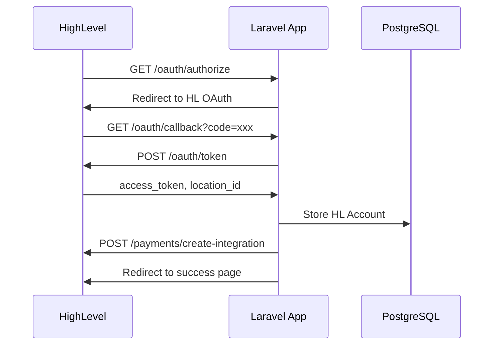
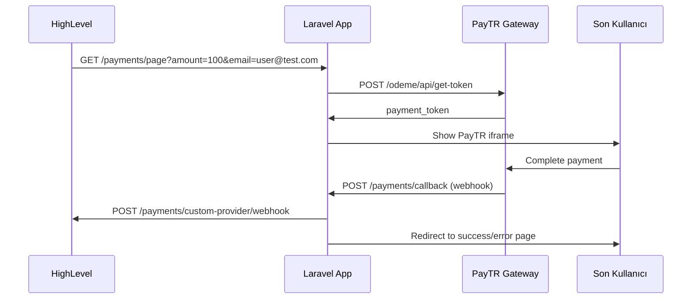
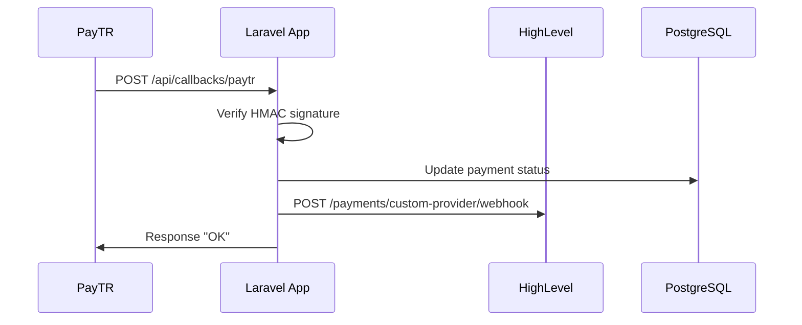

# HighLevel PayTR Integration

Bu proje, **PayTR** (Türk ödeme sağlayıcısı) ile **HighLevel CRM** arasında köprü görevi gören bir **Laravel 12 API** uygulamasıdır. Türkiye'deki ajanslar ve işletmelerin HighLevel CRM'lerinde doğrudan PayTR ile ödeme alabilmelerini sağlar.

## 📋 İçindekiler

- [Proje Genel Bakış](#proje-genel-bakış)
- [Sistem Mimarisi](#sistem-mimarisi)
- [Kurulum](#kurulum)
- [Entegrasyon Akışı](#entegrasyon-akışı)
- [API Dokümantasyonu](#api-dokümantasyonu)
- [PayTR Entegrasyonu](#paytr-entegrasyonu)
- [HighLevel Entegrasyonu](#highlevel-entegrasyonu)
- [Veritabanı Şeması](#veritabanı-şeması)
- [Test Edilmesi](#test-edilmesi)
- [Güvenlik](#güvenlik)
- [Dağıtım](#dağıtım)

## 🎯 Proje Genel Bakış

### Temel Özellikler

- **OAuth 2.0** ile HighLevel entegrasyonu
- **PayTR iframe** ödeme sayfası
- **Webhook** yönetimi (PayTR ↔ HighLevel)
- **Kart saklama** sistemi (PayTR Card Storage API)
- **Ödeme doğrulama** ve durum sorgulama
- **İade işlemleri**
- **Multi-tenant** yapı (location bazlı izolasyon)
- **Kapsamlı logging** sistemi

### Teknoloji Stack

- **Backend**: Laravel 12 (PHP 8.3+)
- **Veritabanı**: PostgreSQL 15
- **Cache**: Redis (opsiyonel)
- **Container**: Docker & Docker Compose
- **Test**: PHPUnit (DatabaseTransactions)
- **API Docs**: OpenAPI/Swagger

## 🏗️ Sistem Mimarisi

```
┌─────────────────┐    ┌──────────────────┐    ┌─────────────────┐
│   HighLevel     │    │   Laravel App    │    │     PayTR       │
│     CRM         │    │   (Bu Proje)     │    │   Gateway       │
└─────────────────┘    └──────────────────┘    └─────────────────┘
         │                       │                       │
         │ 1. OAuth Install      │                       │
         ├──────────────────────▶│                       │
         │                       │                       │
         │ 2. Payment Request    │ 3. PayTR API Call    │
         ├──────────────────────▶├──────────────────────▶│
         │                       │                       │
         │                       │ 4. PayTR Callback    │
         │                       │◀──────────────────────┤
         │                       │                       │
         │ 5. HL Webhook         │                       │
         │◀──────────────────────┤                       │
```

### Akış Detayları

1. **OAuth Kurulum**: HighLevel marketplace'den uygulama kurulumu
2. **Ödeme Talebi**: HighLevel'dan ödeme iframe'i için istek
3. **PayTR Entegrasyonu**: Ödeme token'ı oluşturma ve iframe gösterimi
4. **Callback İşleme**: PayTR'den gelen ödeme sonucu
5. **Webhook Gönderimi**: HighLevel'a ödeme durumu bildirimi

## 🚀 Kurulum

### Gereksinimler

- PHP 8.3+
- Composer 2.0+
- PostgreSQL 15+
- Docker & Docker Compose (önerilen)
- PayTR Merchant Account
- HighLevel Developer Account

### 1. Proje Klonlama

```bash
git clone https://github.com/your-repo/highlevel-paytr-integration.git
cd highlevel-paytr-integration
```

### 2. Environment Kurulumu

```bash
cp .env.example .env
```

`.env` dosyasını düzenleyin:

```env
# Database
DB_CONNECTION=pgsql
DB_HOST=localhost
DB_PORT=5432
DB_DATABASE=highlevel_payments
DB_USERNAME=laravel
DB_PASSWORD=secret

# PayTR Credentials
PAYTR_MERCHANT_ID=your_merchant_id
PAYTR_MERCHANT_KEY=your_merchant_key
PAYTR_MERCHANT_SALT=your_merchant_salt
PAYTR_SUCCESS_URL=https://yourdomain.com/payments/success
PAYTR_FAIL_URL=https://yourdomain.com/payments/error

# HighLevel OAuth
HIGHLEVEL_CLIENT_ID=your_client_id
HIGHLEVEL_CLIENT_SECRET=your_client_secret
HIGHLEVEL_REDIRECT_URI=https://yourdomain.com/oauth/callback
HIGHLEVEL_BASE_URL=https://backend.leadconnectorhq.com
```

### 3. Docker ile Başlatma

```bash
# Servisleri başlat
docker-compose up -d

# Bağımlılıkları yükle
composer install

# Veritabanı migration'ları çalıştır
php artisan migrate

# Uygulama key'i oluştur
php artisan key:generate
```

### 4. Development Server

```bash
php artisan serve
```

## 🔄 Entegrasyon Akışı

### 1. OAuth Kurulum Akışı



### 2. Ödeme Akışı



### 3. Webhook Akışı



## 📡 API Dokümantasyonu

### OAuth Endpoints

| Method | Endpoint | Açıklama |
|--------|----------|----------|
| GET | `/oauth/authorize` | HighLevel OAuth başlatma |
| GET | `/oauth/callback` | OAuth callback işleme |
| POST | `/oauth/uninstall` | Uygulama kaldırma |
| GET | `/oauth/success` | Başarı sayfası |
| GET | `/oauth/error` | Hata sayfası |

### Payment Endpoints

| Method | Endpoint | Açıklama |
|--------|----------|----------|
| GET | `/payments/page` | PayTR iframe sayfası |
| POST | `/payments/callback` | PayTR callback |
| GET | `/payments/success` | Ödeme başarı sayfası |
| GET | `/payments/error` | Ödeme hata sayfası |

### API Endpoints

| Method | Endpoint | Açıklama |
|--------|----------|----------|
| POST | `/api/payments/query` | HighLevel sorguları |
| POST | `/api/payments/status` | Ödeme durum sorgulama |
| POST | `/api/callbacks/paytr` | PayTR webhook'ları |
| POST | `/api/webhooks/marketplace` | HL marketplace webhook'ları |
| POST | `/api/webhooks/highlevel` | HL payment webhook'ları |

### HighLevel Query Types

#### 1. Payment Verification

```json
POST /api/payments/query
Headers: X-Location-Id: loc_123

{
  "type": "verify",
  "transactionId": "txn_123"
}

Response:
{
  "success": true,
  "chargeId": "ch_123",
  "amount": 100.50
}
```

#### 2. List Payment Methods

```json
{
  "type": "list_payment_methods",
  "contactId": "contact_123"
}

Response:
{
  "paymentMethods": [
    {
      "id": "pm_123",
      "type": "visa",
      "title": "Visa ****4242",
      "subTitle": "Son kullanma: 12/25",
      "expiry": "12/25",
      "imageUrl": "https://..."
    }
  ]
}
```

#### 3. Charge Payment Method

```json
{
  "type": "charge_payment",
  "paymentMethodId": "pm_123",
  "contactId": "contact_123",
  "transactionId": "txn_456",
  "amount": 150.00,
  "email": "user@example.com"
}
```

#### 4. Refund

```json
{
  "type": "refund",
  "chargeId": "ch_123",
  "amount": 50.00
}
```

## 💳 PayTR Entegrasyonu

### Hash Oluşturma

PayTR tüm API çağrıları için HMAC-SHA256 imzası gerektirir:

```php
$hash_str = $merchant_id . $user_ip . $merchant_oid . $email .
            $payment_amount . $user_basket . $no_installment .
            $max_installment . $currency . $test_mode . $merchant_salt;

$paytr_token = base64_encode(hash_hmac('sha256', $hash_str, $merchant_key, true));
```

### Callback Doğrulama

PayTR callback'lerini doğrulama:

```php
$hash = base64_encode(hash_hmac('sha256',
    $merchant_oid . $merchant_salt . $status . $total_amount,
    $merchant_key, true));

if ($hash !== $_POST['hash']) {
    exit('PAYTR notification failed: invalid hash');
}

echo "OK"; // PayTR'ye onay
```

### Kart Saklama

PayTR'nin kart saklama API'si:

1. **Yeni Kart Ekleme**: `utoken` ve `ctoken` parametreleri
2. **Saklı Kartları Listeleme**: Kullanıcının kayıtlı kartları
3. **Saklı Kartla Ödeme**: `ctoken` ile ödeme
4. **Kart Silme**: Kayıtlı kartı kaldırma

## 🔗 HighLevel Entegrasyonu

### Gerekli OAuth Scope'ları

```
payments/orders.readonly
payments/orders.write
payments/subscriptions.readonly
payments/transactions.readonly
payments/custom-provider.readonly
payments/custom-provider.write
products.readonly
products/prices.readonly
```

### Marketplace Konfigürasyonu

- **Redirect URL**: `https://yourdomain.com/oauth/callback`
- **Webhook URL**: `https://yourdomain.com/api/webhooks/marketplace`
- **Query URL**: `https://yourdomain.com/api/payments/query`
- **Payments URL**: `https://yourdomain.com/payments/page`

### Frontend Events (postMessage)

```javascript
// Iframe hazır
window.parent.postMessage({
  type: 'custom_provider_ready'
}, '*');

// Ödeme başarılı
window.parent.postMessage({
  type: 'custom_element_success_response',
  chargeId: 'ch_123'
}, '*');

// Ödeme başarısız
window.parent.postMessage({
  type: 'custom_element_error_response',
  error: 'Card declined'
}, '*');

// Kullanıcı iptal etti
window.parent.postMessage({
  type: 'custom_element_close_response'
}, '*');
```

### Webhook Events (HighLevel'a gönderilen)

```json
POST https://backend.leadconnectorhq.com/payments/custom-provider/webhook

{
  "event": "payment.captured",
  "chargeId": "ch_123",
  "amount": 100.50,
  "currency": "TRY",
  "locationId": "loc_123"
}
```

## 🗄️ Veritabanı Şeması

### hl_accounts
HighLevel OAuth bilgileri ve tenant yönetimi:

```sql
CREATE TABLE hl_accounts (
    id BIGSERIAL PRIMARY KEY,
    location_id VARCHAR(255) NOT NULL UNIQUE,
    company_id VARCHAR(255),
    user_id VARCHAR(255),
    access_token TEXT NOT NULL,
    refresh_token TEXT,
    token_expires_at TIMESTAMP,
    integration_id VARCHAR(255),
    is_active BOOLEAN DEFAULT true,
    created_at TIMESTAMP,
    updated_at TIMESTAMP
);
```

### payments
Ödeme transaction kayıtları:

```sql
CREATE TABLE payments (
    id BIGSERIAL PRIMARY KEY,
    hl_account_id BIGINT REFERENCES hl_accounts(id),
    location_id VARCHAR(255) NOT NULL,
    contact_id VARCHAR(255),
    transaction_id VARCHAR(255),
    merchant_oid VARCHAR(255) NOT NULL UNIQUE,
    charge_id VARCHAR(255),
    provider_payment_id VARCHAR(255),
    amount DECIMAL(10,2) NOT NULL,
    currency VARCHAR(3) DEFAULT 'TRY',
    status VARCHAR(50) NOT NULL,
    payment_method_type VARCHAR(50),
    error_message TEXT,
    metadata JSON,
    created_at TIMESTAMP,
    updated_at TIMESTAMP
);
```

### payment_methods
Saklı kart bilgileri:

```sql
CREATE TABLE payment_methods (
    id BIGSERIAL PRIMARY KEY,
    hl_account_id BIGINT REFERENCES hl_accounts(id),
    location_id VARCHAR(255) NOT NULL,
    contact_id VARCHAR(255) NOT NULL,
    utoken VARCHAR(255),
    ctoken VARCHAR(255),
    card_type VARCHAR(50),
    card_last_four VARCHAR(4),
    card_expiry VARCHAR(7),
    card_holder_name VARCHAR(255),
    is_default BOOLEAN DEFAULT false,
    is_active BOOLEAN DEFAULT true,
    created_at TIMESTAMP,
    updated_at TIMESTAMP
);
```

### webhook_logs
Webhook tracking ve debugging:

```sql
CREATE TABLE webhook_logs (
    id BIGSERIAL PRIMARY KEY,
    type VARCHAR(50), -- 'incoming', 'outgoing'
    source VARCHAR(100), -- 'paytr_callback', 'highlevel_marketplace'
    event VARCHAR(100),
    payload JSON,
    response JSON,
    status VARCHAR(50), -- 'success', 'failed', 'pending'
    http_status_code INTEGER,
    error_message TEXT,
    received_at TIMESTAMP,
    processed_at TIMESTAMP,
    created_at TIMESTAMP
);
```

### user_activity_logs
Kullanıcı ve sistem aktivite takibi:

```sql
CREATE TABLE user_activity_logs (
    id BIGSERIAL PRIMARY KEY,
    hl_account_id BIGINT REFERENCES hl_accounts(id),
    location_id VARCHAR(255),
    user_id VARCHAR(255),
    action VARCHAR(100), -- 'oauth_success', 'payment_created'
    resource_type VARCHAR(50),
    resource_id VARCHAR(255),
    metadata JSON,
    ip_address INET,
    user_agent TEXT,
    created_at TIMESTAMP
);
```

## 🧪 Test Edilmesi

### Test Kurulumu

```bash
# Test veritabanı oluştur
createdb highlevel_payments_test

# Testleri çalıştır
php artisan test

# Coverage raporu
php artisan test --coverage
```

### Test Yapısı

Tüm testler `DatabaseTransactions` kullanır (RefreshDatabase yerine):

```php
use Illuminate\Foundation\Testing\DatabaseTransactions;

class PaymentControllerTest extends TestCase
{
    use DatabaseTransactions;
    
    /** @test */
    public function it_processes_successful_payment()
    {
        // Test her çalıştırmada transaction içinde
        // Test bitince otomatik rollback
    }
}
```

### Test Kategorileri

1. **Feature Tests**:
   - `OAuthControllerTest`: OAuth akışı testleri
   - `PaymentControllerTest`: Ödeme işlemleri testleri
   - `WebhookControllerTest`: Webhook testleri

2. **Unit Tests**:
   - Service sınıfları
   - Helper fonksiyonları
   - Model ilişkileri

### Test Verisi

Factory'ler kullanılarak test verisi oluşturma:

```php
// Test account oluştur
$account = HLAccount::factory()->create([
    'location_id' => 'test_location_123'
]);

// Test payment oluştur
$payment = Payment::factory()->successful()->create([
    'hl_account_id' => $account->id,
    'amount' => 100.50
]);
```

## 🔒 Güvenlik

### PayTR Güvenliği

1. **HMAC Doğrulama**: Tüm PayTR istekleri imzalanır
2. **Merchant Key**: Asla frontend'e açılmaz
3. **IP Doğrulama**: PayTR callback IP'leri kontrol edilir
4. **SSL/TLS**: Tüm iletişim HTTPS üzerinden

### HighLevel Güvenliği

1. **OAuth 2.0**: Standart OAuth akışı
2. **Token Rotation**: Refresh token ile yenileme
3. **Scope Limitation**: Minimum gerekli yetkiler
4. **Webhook Signature**: HL webhook'ları imzalanır

### Genel Güvenlik

```php
// Hassas verileri şifrele
$encrypted = encrypt($sensitive_data);

// Rate limiting
Route::middleware('throttle:60,1')->group(function () {
    Route::post('/api/payments/query', [PaymentController::class, 'query']);
});

// CORS policy
'allowed_origins' => ['https://app.gohighlevel.com'],

// Input validation
$request->validate([
    'amount' => 'required|numeric|min:0.01|max:999999.99',
    'email' => 'required|email',
    'transactionId' => 'required|string|max:255'
]);
```

### Environment Variables

```env
# Hassas veriler environment'ta
PAYTR_MERCHANT_KEY=your_secret_key
HIGHLEVEL_CLIENT_SECRET=your_client_secret
DB_PASSWORD=strong_password
APP_KEY=base64:generated_key
```

## 🚀 Dağıtım

### Production Checklist

- [ ] SSL sertifikası kurulumu
- [ ] Environment variables ayarı
- [ ] Database migration'ları
- [ ] Log rotation konfigürasyonu
- [ ] Backup stratejisi
- [ ] Monitoring kurulumu
- [ ] Error tracking (Sentry)
- [ ] Performance monitoring

### Docker Production

```dockerfile
FROM php:8.3-fpm-alpine

# Production optimizations
RUN docker-php-ext-install pdo_pgsql opcache
COPY docker/php/opcache.ini /usr/local/etc/php/conf.d/

# Application
COPY . /var/www/html
RUN composer install --no-dev --optimize-autoloader
RUN php artisan config:cache
RUN php artisan route:cache
RUN php artisan view:cache
```

### Nginx Konfigürasyonu

```nginx
server {
    listen 80;
    server_name yourdomain.com;
    root /var/www/html/public;
    index index.php;

    location / {
        try_files $uri $uri/ /index.php?$query_string;
    }

    location ~ \.php$ {
        fastcgi_pass app:9000;
        fastcgi_index index.php;
        fastcgi_param SCRIPT_FILENAME $realpath_root$fastcgi_script_name;
        include fastcgi_params;
    }

    # PayTR iframe için
    add_header X-Frame-Options "ALLOWALL";
    add_header Content-Security-Policy "frame-ancestors *";
}
```

### Monitoring

```php
// app/Http/Middleware/LogRequests.php
public function handle($request, Closure $next)
{
    $start = microtime(true);
    $response = $next($request);
    $duration = microtime(true) - $start;
    
    Log::info('Request processed', [
        'method' => $request->method(),
        'url' => $request->fullUrl(),
        'duration' => $duration,
        'status' => $response->status(),
        'memory' => memory_get_peak_usage(true)
    ]);
    
    return $response;
}
```

## 📊 Logging ve İzleme

### Log Yapısı

```
storage/logs/
├── laravel.log              # Genel uygulama logları
├── payments/
│   ├── 2024-01-15.log      # Günlük ödeme logları
│   └── 2024-01-16.log
├── webhooks/
│   ├── paytr-2024-01-15.log    # PayTR webhook logları
│   └── highlevel-2024-01-15.log # HL webhook logları
└── errors/
    └── 2024-01-15.log      # Hata logları
```

### Log Format

```json
{
  "timestamp": "2024-01-15T10:30:00Z",
  "level": "info",
  "message": "Payment processed successfully",
  "context": {
    "location_id": "loc_123",
    "transaction_id": "txn_456",
    "amount": 100.50,
    "currency": "TRY",
    "payment_method": "visa",
    "duration_ms": 1250
  },
  "extra": {
    "request_id": "req_789",
    "user_agent": "Mozilla/5.0...",
    "ip_address": "192.168.1.1"
  }
}
```

## 🔧 Geliştirme Notları

### Kod Yapısı

```
app/
├── Http/Controllers/
│   ├── OAuthController.php         # HighLevel OAuth işlemleri
│   ├── PaymentController.php       # Ödeme sayfası ve API sorguları
│   └── WebhookController.php       # Webhook işleyicileri
├── Services/
│   ├── PaymentService.php          # Ödeme business logic
│   ├── HighLevelService.php        # HL API işlemleri
│   └── PayTRService.php            # PayTR API işlemleri
├── Models/
│   ├── HLAccount.php               # HighLevel hesap modeli
│   ├── Payment.php                 # Ödeme modeli
│   ├── PaymentMethod.php           # Saklı kart modeli
│   └── WebhookLog.php              # Webhook log modeli
├── PaymentGateways/
│   ├── PaymentProviderInterface.php
│   ├── PayTRPaymentProvider.php    # PayTR implementasyonu
│   └── PaymentProviderFactory.php  # Provider factory
└── Logging/
    ├── PaymentLogger.php           # Ödeme logları
    ├── WebhookLogger.php           # Webhook logları
    └── UserActionLogger.php        # Aktivite logları
```

### Önemli Sınıflar

#### PaymentService

```php
class PaymentService
{
    public function initiatePayment(array $data): PaymentResponse
    {
        // 1. Validate input
        // 2. Create payment record
        // 3. Generate PayTR token
        // 4. Return iframe URL
    }
    
    public function processCallback(array $callbackData): bool
    {
        // 1. Verify PayTR signature
        // 2. Update payment status
        // 3. Send HighLevel webhook
        // 4. Log transaction
    }
}
```

#### HighLevelService

```php
class HighLevelService
{
    public function exchangeCodeForToken(string $code): array
    {
        // OAuth token exchange
    }
    
    public function sendPaymentWebhook(string $locationId, array $data): bool
    {
        // Send payment status to HighLevel
    }
    
    public function createIntegration(string $locationId): bool
    {
        // Register payment provider
    }
}
```

## 🐛 Troubleshooting

### Yaygın Sorunlar

#### 1. PayTR Hash Hatası

```
PAYTR notification failed: invalid hash
```

**Çözüm**: Merchant key ve salt değerlerini kontrol edin:

```php
// Hash string sırası önemli
$hash_str = $merchant_id . $user_ip . $merchant_oid . $email .
            $payment_amount . $user_basket . $no_installment .
            $max_installment . $currency . $test_mode . $merchant_salt;
```

#### 2. HighLevel OAuth Hatası

```
invalid_client: Client authentication failed
```

**Çözüm**: OAuth credentials ve redirect URI'yı kontrol edin.

#### 3. Database Bağlantı Hatası

```
SQLSTATE[08006] [7] could not connect to server
```

**Çözüm**: PostgreSQL servisini ve connection string'i kontrol edin.

#### 4. Iframe Yükleme Sorunu

```
Refused to display in a frame because it set 'X-Frame-Options' to 'deny'
```

**Çözüm**: PayTR sayfası için frame-ancestors ayarını güncelleyin.

### Debug Modları

```env
# Development
APP_DEBUG=true
LOG_LEVEL=debug

# PayTR test modu
PAYTR_TEST_MODE=1

# HighLevel sandbox
HIGHLEVEL_BASE_URL=https://backend-sandbox.leadconnectorhq.com
```

### Log Analizi

```bash
# Son ödeme loglarını görüntüle
tail -f storage/logs/payments/$(date +%Y-%m-%d).log

# Hata loglarını filtrele
grep "ERROR" storage/logs/laravel.log | tail -20

# Webhook başarısızlıklarını bul
grep "webhook_failed" storage/logs/laravel.log
```

## 📈 Performans Optimizasyonu

### Database İndeksler

```sql
-- Önemli indeksler
CREATE INDEX idx_hl_accounts_location_id ON hl_accounts(location_id);
CREATE INDEX idx_payments_location_id ON payments(location_id);
CREATE INDEX idx_payments_merchant_oid ON payments(merchant_oid);
CREATE INDEX idx_payments_transaction_id ON payments(transaction_id);
CREATE INDEX idx_payment_methods_contact_id ON payment_methods(contact_id);
CREATE INDEX idx_webhook_logs_created_at ON webhook_logs(created_at);
```

### Cache Stratejisi

```php
// PayTR token cache (kısa süreli)
Cache::put('paytr_token_' . $merchantOid, $token, now()->addMinutes(30));

// HighLevel account cache
Cache::remember('hl_account_' . $locationId, 3600, function () use ($locationId) {
    return HLAccount::where('location_id', $locationId)->first();
});

// Payment method cache
Cache::remember('payment_methods_' . $contactId, 1800, function () use ($contactId) {
    return PaymentMethod::where('contact_id', $contactId)->active()->get();
});
```

### Queue İşlemleri

```php
// Webhook gönderimini queue'ya al
dispatch(new SendHighLevelWebhookJob($payment));

// Asenkron log yazma
dispatch(new LogPaymentActivityJob($logData))->onQueue('logging');

// Başarısız webhook retry
dispatch(new RetryFailedWebhookJob($webhookLogId))
    ->delay(now()->addMinutes(5))
    ->onQueue('retries');
```

## 🔮 Gelecek Özellikler

### Planlanan Geliştirmeler

1. **Çoklu Ödeme Sağlayıcısı**:
   - Stripe entegrasyonu
   - Iyzico entegrasyonu
   - Provider seçim sistemi

2. **Gelişmiş Raporlama**:
   - Dashboard arayüzü
   - Ödeme analytics
   - Hata raporları
   - Performans metrikleri

3. **Abonelik Sistemi**:
   - Recurring payments
   - Subscription management
   - Dunning management

4. **Multi-currency Desteği**:
   - USD, EUR desteği
   - Döviz kuru entegrasyonu
   - Currency conversion

5. **Gelişmiş Güvenlik**:
   - 3D Secure entegrasyonu
   - Fraud detection
   - Risk scoring

### Katkıda Bulunma

1. Fork edin
2. Feature branch oluşturun (`git checkout -b feature/amazing-feature`)
3. Değişikliklerinizi commit edin (`git commit -m 'Add amazing feature'`)
4. Branch'inizi push edin (`git push origin feature/amazing-feature`)
5. Pull Request oluşturun

### Lisans

Bu proje MIT lisansı altında lisanslanmıştır. Detaylar için `LICENSE` dosyasına bakın.

### İletişim

- **Geliştirici**: Proje Ekibi
- **E-posta**: dev@company.com
- **Dokümantasyon**: `technical_documentation/` klasörü
- **API Docs**: `/swagger.json`

---

⚡ **Hızlı Başlangıç**: `docker-compose up -d && php artisan migrate && php artisan serve`